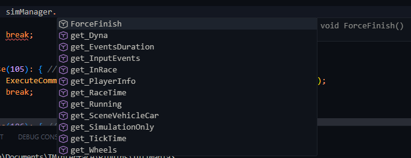

# What is it?

It is types definition for TMInterface made by donadigo for writing Angelscript plugins.

## How to use it?

Just install the sashi0034's AngelScript Language Server extention for Visual Studio Code from the [Extensions marketplace](https://github.com/sashi0034/angel-lsp), and drag the "as.predefined" file to your root directory. Now you see all the warnings and linting for your types:

### API Reference

I took it from [official donadigo's site](https://donadigo.com/tminterface/plugins/api/all)
